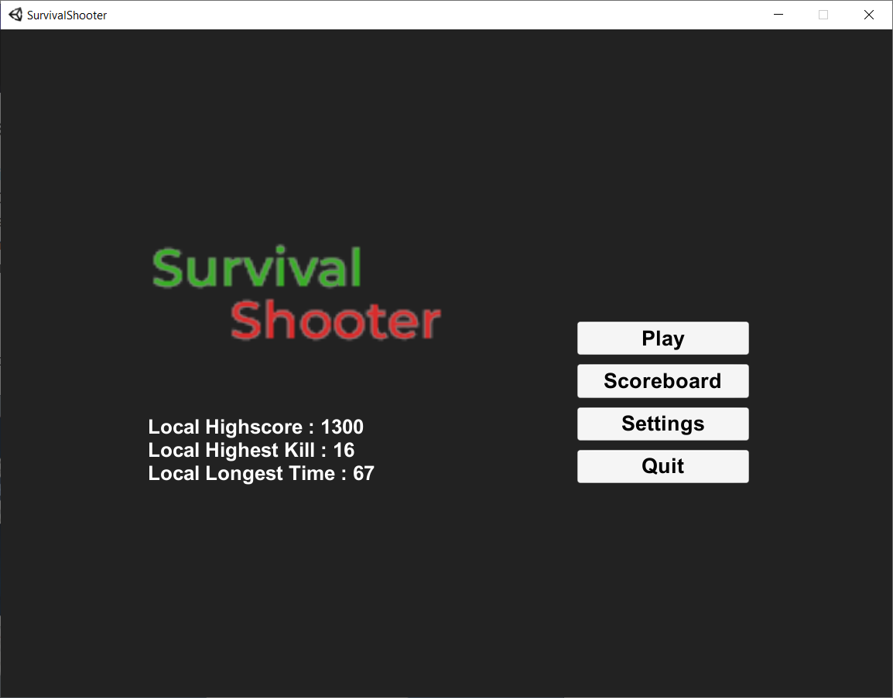
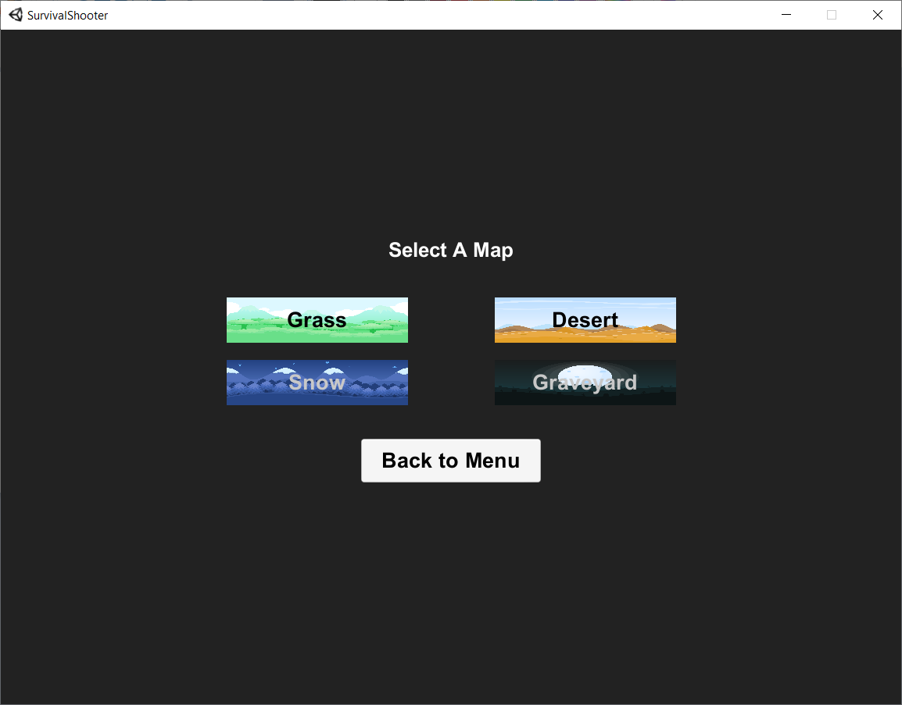
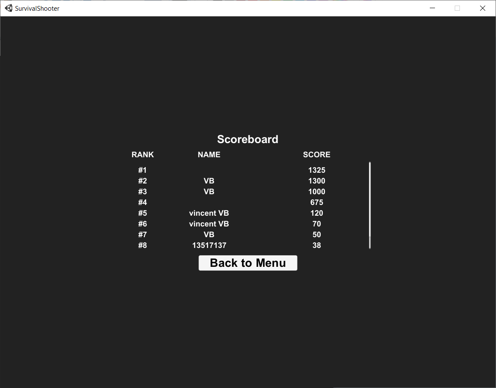
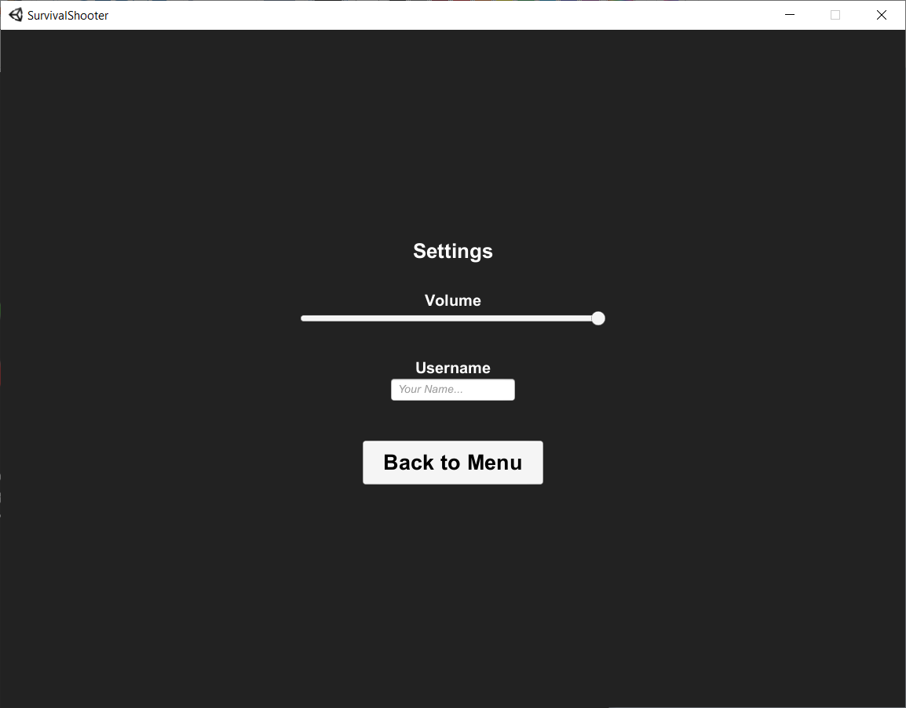
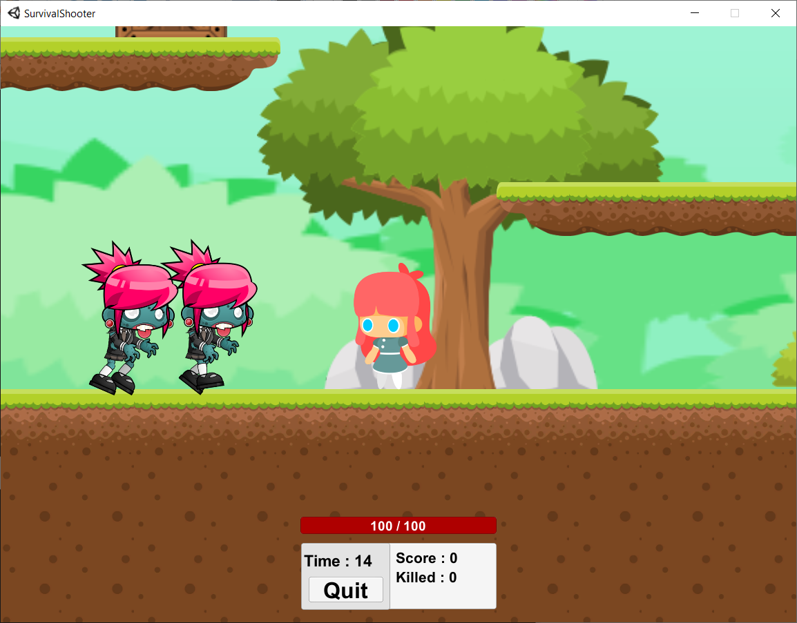
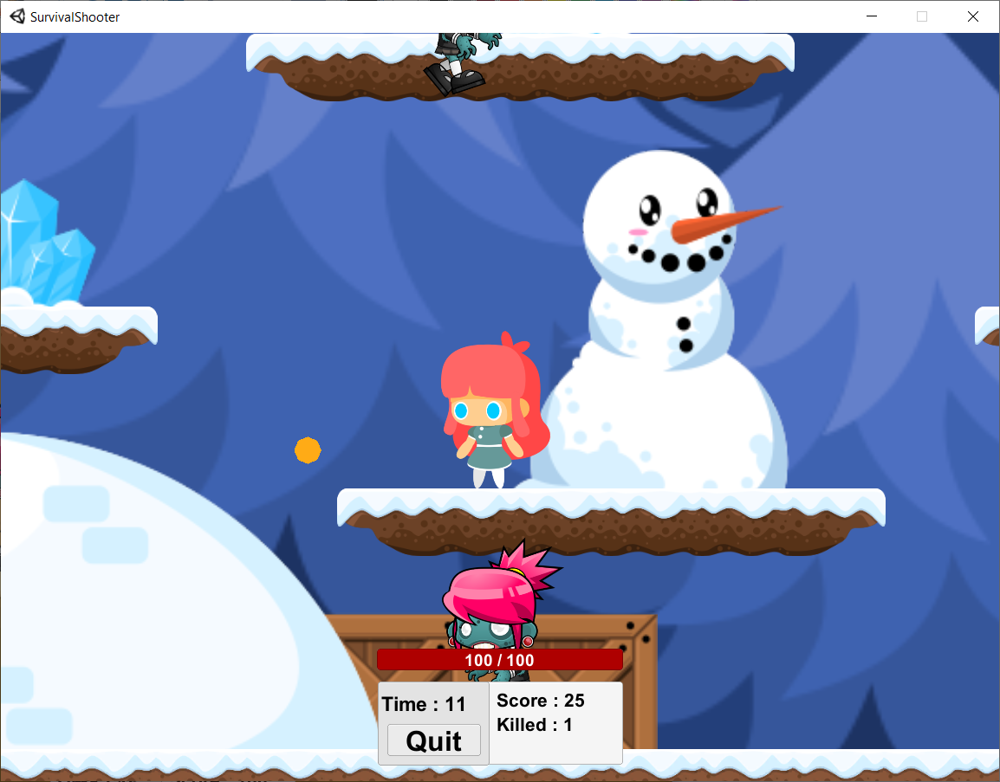
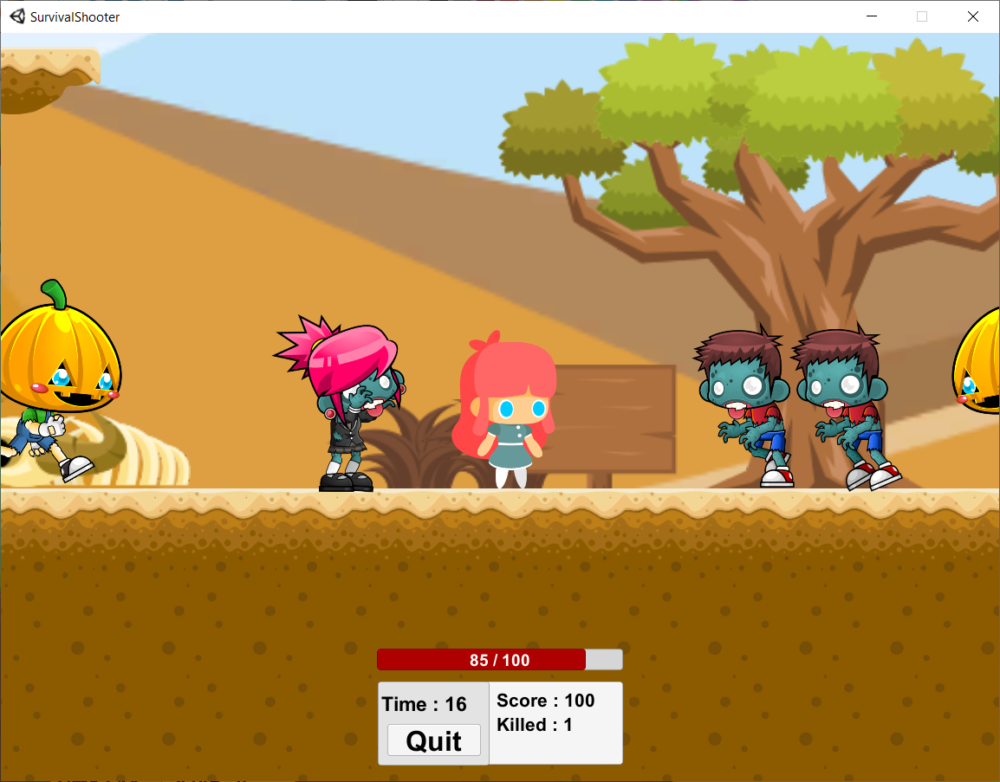
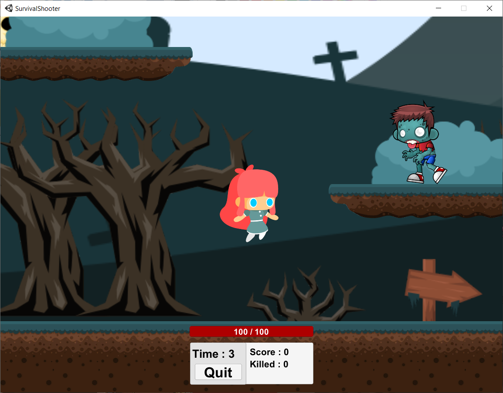
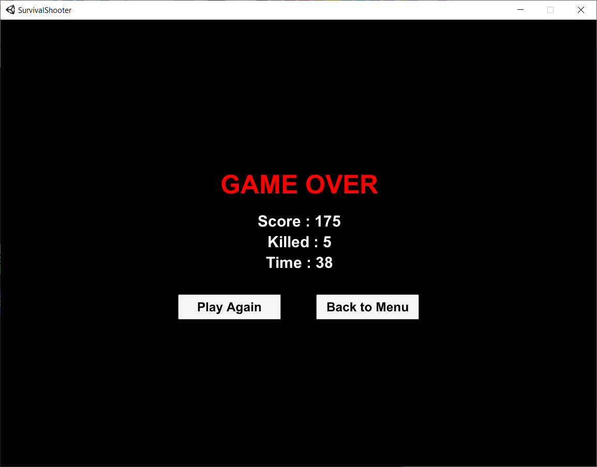

<h1 align="center">
    <b>
         
        # Tugas Besar 2 IF3210 Pengembangan Aplikasi Platform Khusus
         
    </b>
</h1>

<h2 align="center">
    <b>
        Unity - Survival Shooter
         
         
    </b>
</h2>

## Deskripsi aplikasi
SurvivalShooter merupakan suatu game platformer 2D dengan gameplay wave survival. Pemain harus menghindari atau menembak zombie-zombie yang ingin menyerang pemain. Suatu game akan terus berjalan sampai nyawa karakter (Hp) mencapai 0.

## Cara kerja
Untuk *scene* permainan pada *game* SurvivalShooter ini, saya menggunakan 4 sprites (1 untuk karakter pemain dan 3 untuk musuh) dan 4 scene yang diambil dari [https://www.gameart2d.com/freebies.html](https://www.gameart2d.com/freebies.html). Setelah environment (membuat *prefabs* pemain dan musuh, animasi pemain dan musuh, peta permainan, *camera*, *UI* permainan dan penempatan *spawn point*) permainan disiapkan, *camera* di-*set* agar selalu memosisikan pemain sebagai fokusnya. Musuh akan di-*generate* secara *random* di *spawn point* yang sudah di-*set* sebelumnya oleh *game manager*. Ketika *collider* musuh mengenai *collider* pemain maka musuh akan melakukan animasi menyerang dan nyawa pemain akan berkurang. Jika nyawa pemain sampai habis (mencapai 0) permainan akan berakhir dan *game* akan menampilkan *score*, jumlah musuh yang dibunuh dan lama pemain bermain serta mengirimkan hasil permainan ke basis data *online*. Selain *scene* permainan, terdapat *scene menu* yang menjadi tampilan pertama yang akan ditemui pemain. Pemain dapat melihat *scoreboard*, mengatur *settings* dan memilih peta permainan melalui *scene menu*. Data yang ditampilkan pada *scoreboard* merupakan data yang didapat dari basis data *online*.

## Game key configuration
| Key   | Functions                       |
|:-----:|:--------------------------------|
| A     | Move the character to the left  |
| D     | Move the character to the right |
| W     | Make the character to jump      |
| Space | Shoot normal bullet             |
| F     | Shoot push bullet               |
| Q     | Shoot special bullet            |

## Library yang digunakan dan justifikasi penggunaannya
* UnityEngine
  * Digunakan untuk melakukan interaksi dengan *unity classes* dan *unity functions*
* UnityEngine.Events
  * Digunakan untuk melakukan interaksi dengan *unity event* (digunakan sebagai penanda apakah karakter sedang menyentuh tanah atau tidak)
* UnityEngine.Networking
  * Digunakan untuk melakukan *HTTP request* (digunakan untuk melakukan method *POST* dan *GET* ke basis data *online*)
* UnityEngine.SceneManagement
  * Digunakan untuk menentukan scene yang akan ditampilkan (digunakan untuk mengganti *scene* antar *scene menu*, *scene grass*, *scene snow*, *scene desert*, *scene graveyard* dan *scene game over*)
* UnityEngine.UI
  * Digunakan untuk melakukan interaksi dengan *unity objects* (digunakan untuk mengubah isi suatu teks)
* System.Collections dan System.Collections.Generic
  * Digunakan untuk mengubah *string* menjadi *byteArray* dan mengubah *data json* menjadi bentuk *array* suatu *class*
* System.Linq dan System.Linq.Expressions
  * Digunakan untuk melakukan sorting score yang ditampilkan pada scoreboard
* System.Text
  * Digunakan untuk melakukan *encoding string* menjadi *byte*

## Screenshot
### Menu

### Select Map

### Scoreboard

### Settings

### Grass Map

### Snow Map

### Desert Map

### Graveyard Map

### GameOver

    <b>
         
        
            About
        
    </b>

    <b>
        IF3210-Pengembangan Aplikasi Platform Khusus - 2020
         
        Teknik Informatika 2017
         
         
        13517137 - Vincent Budianto
    </b>

